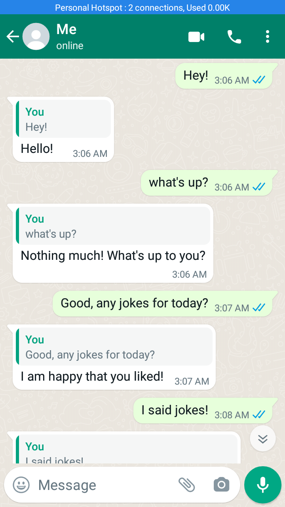
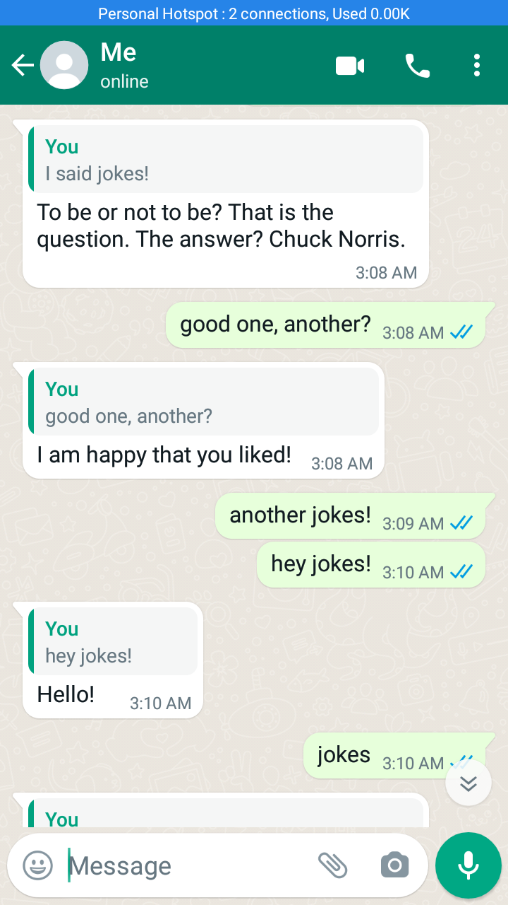
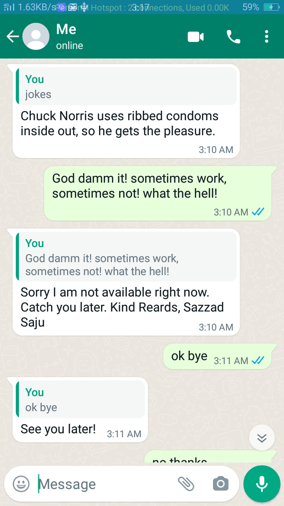
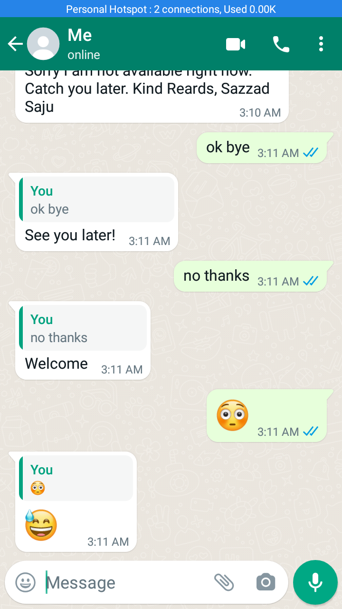

# WhatsApp Intelligent Chatbot
[](https://forthebadge.com)[](https://forthebadge.com)

Automatic replies certain queries correctly, otherwise reply default message to a selected list of contacts. Tell jokes to users if asked. A beginners step to
an intelligent chatbot.

# Installation

Install node.js client library for WhatsApp
```bash
npm install whatsapp-web.js
```
Install QR code generator
```bash
npm i qrcode-terminal
```
Install nodemon
```bash
istall npm install nodemon –g
```
Install fetch for node.js
```bash
npm install node-fetch@2
```
Run code from terminal: `nodemon server.js`. If still gets error: open PowerShell as administrator command `set-ExecutionPolicy Unrestricted` then `A: yes to all`. Set up done. The output produces a QR code, scan QR code with your What's app for authentication.  

# Screenshots

<p>
  
  
 </p>
<p> 
    
    
  </p>
  <br> 

